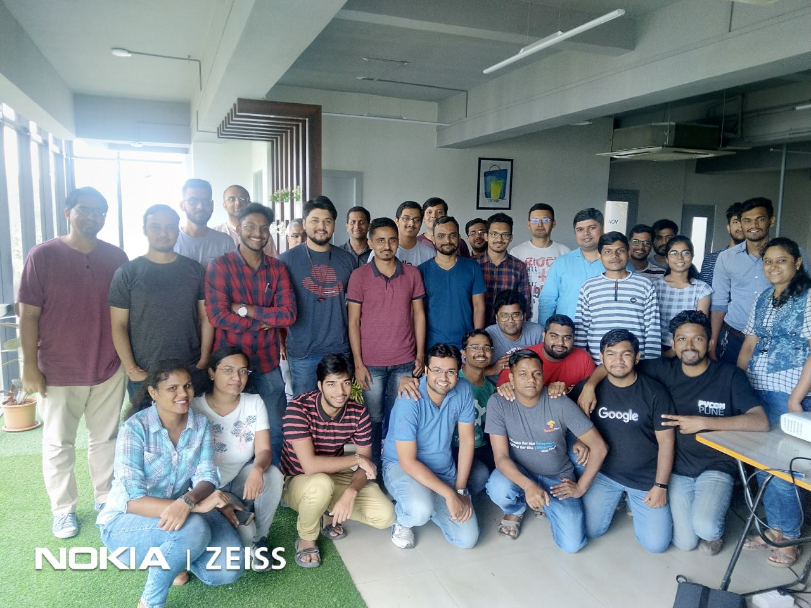

# Python Pune 

“If there's a book that you want to read, but it hasn't been written yet, then you must write it.”
― Toni Morrison 

It's a pleasant morning and I was looking at my calendar and bang its Saturday time to have some fun to meet new peoples ( #meetup_day ).

It's 9:00 AM I got a call from my friend [Akshay Gaikwad](https://twitter.com/AkshayG196) and he informs me that how we are driving to our destination [Shoptimize India Private Limited](https://twitter.com/shoptimizeindia).

then around 9:15 AM I meet [Chandan Kumar](https://twitter.com/raukadah) and Bhusan and book our Ride.
now it's a road trip of 30-40 min and we discuss about talks that are going to be held in the meetup and I am very excited about them because it's my first time for #Pythonpune.

We reach our [Shoptimize India Private Limited](https://twitter.com/shoptimizeindia) around 9:55 AM.

And it's a lucky day for me I meet [Bhavin Gandhi](https://twitter.com/_bhavin192) one of my Guider, Mentor since my college days it's very nice to meet him by face for the first time.
He tells me a few more interesting things about spreading knowledge and how to get started with new things.

And around 10:15 AM we start first of all we introduce ourself one by one and then we start with Abhijit's talk about there tech stack at [Shoptimize India Private Limited](https://twitter.com/shoptimizeindia) it's really interesting how they are integrating AWS and [Python](https://www.python.org/).

Now it's time to move towards our next talk which is Hidden Secrets of Python by [Chaitanya Rahalkar](https://twitter.com/chairahalkar) and [Anushka Virgaonkar](https://www.facebook.com/anushka.virgaonkar).

They point out some cool tricks that we can use in our code to make it sort and simple like one-liner If-Else, nesting calling of functions and Touple unpacking.

Now we move toward our net talk by [Sundeep Anand](https://twitter.com/sundeep_co_in) about [log-today](https://github.com/sundeep-co-in/makegoalsdaily). It's really funny but important. He devlop a tool to track yourself daily and stay focused. and he show a demo about the functionality of the tool.

Next, it's time finding matching patterns with the help of Regular Expressions. [Deepa](https://twitter.com/deepscbe) comes with great talk Regular Expressions - A Closer Look.

She uses a few examples and show some use cases or regular expression and give a brief about how to use special characters in regular expressions.

It's about 12:15 PM now it's time for questions and [Chandan Kumar](https://twitter.com/raukadah) let's know about the Upcoming events, Projects & libraries to check out.

We are done with all the talks and feeling a bit hungry so we have snacks  😋, after snacks, t's time to say goodbye so we talk to other participants and left.